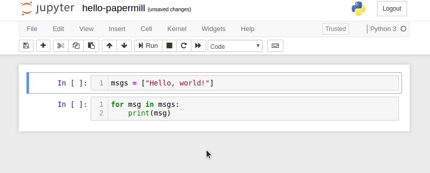
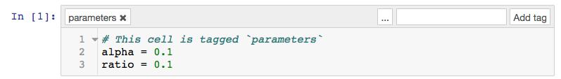

<a href="https://github.com/nteract/papermill"></a>
=======================================================================================================================================================================

<!---(binder links generated at https://mybinder.readthedocs.io/en/latest/howto/badges.html and compressed at https://tinyurl.com) -->
[](https://travis-ci.org/nteract/papermill)
[](https://dev.azure.com/nteract/nteract/_build/latest?definitionId=5&branchName=main)
[](https://codecov.io/github/nteract/papermill?branch=main)
[](http://papermill.readthedocs.io/en/latest/?badge=latest)
[](https://mybinder.org/v2/gh/nteract/papermill/main?filepath=binder%2Fprocess_highlight_dates.ipynb)
[](https://mybinder.org/v2/gh/nteract/papermill/main?)
[](https://www.python.org/downloads/release/python-360/)
[](https://www.python.org/downloads/release/python-370/)
[](https://www.python.org/downloads/release/python-380/)
[](https://github.com/ambv/black)

**papermill** is a tool for parameterizing, executing, and analyzing
Jupyter Notebooks.

Papermill lets you:

-   **parameterize** notebooks
-   **execute** notebooks

This opens up new opportunities for how notebooks can be used. For
example:

-   Perhaps you have a financial report that you wish to run with
    different values on the first or last day of a month or at the
    beginning or end of the year, **using parameters** makes this task
    easier.
-   Do you want to run a notebook and depending on its results, choose a
    particular notebook to run next? You can now programmatically
    **execute a workflow** without having to copy and paste from
    notebook to notebook manually.

Papermill takes an *opinionated* approach to notebook parameterization and
execution based on our experiences using notebooks at scale in data
pipelines.

## Installation

From the command line:

``` {.sourceCode .bash}
pip install papermill
```

For all optional io dependencies, you can specify individual bundles
like `s3`, or `azure` -- or use `all`

``` {.sourceCode .bash}
pip install papermill[all]
```

## Python Version Support

This library currently supports Python 3.5+ versions. As minor Python
versions are officially sunset by the Python org papermill will similarly
drop support in the future.

## Usage

### Parameterizing a Notebook

To parameterize your notebook designate a cell with the tag ``parameters``.



Papermill looks for the ``parameters`` cell and treats this cell as defaults for the parameters passed in at execution time. Papermill will add a new cell tagged with ``injected-parameters`` with input parameters in order to overwrite the values in ``parameters``. If no cell is tagged with ``parameters`` the injected cell will be inserted at the top of the notebook.

Additionally, if you rerun notebooks through papermill and it will reuse the ``injected-parameters`` cell from the prior run. In this case Papermill will replace the old ``injected-parameters`` cell with the new run's inputs.



### Executing a Notebook

The two ways to execute the notebook with parameters are: (1) through
the Python API and (2) through the command line interface.

#### Execute via the Python API

``` {.sourceCode .python}
import papermill as pm

pm.execute_notebook(
   'path/to/input.ipynb',
   'path/to/output.ipynb',
   parameters = dict(alpha=0.6, ratio=0.1)
)
```

#### Execute via CLI

Here's an example of a local notebook being executed and output to an
Amazon S3 account:

``` {.sourceCode .bash}
$ papermill local/input.ipynb s3://bkt/output.ipynb -p alpha 0.6 -p l1_ratio 0.1
```

**NOTE:**
If you use multiple AWS accounts, and you have [properly configured your AWS  credentials](https://boto3.amazonaws.com/v1/documentation/api/latest/guide/configuration.html), then you can specify which account to use by setting the `AWS_PROFILE` environment variable at the command-line. For example:

``` {.sourceCode .bash}
$ AWS_PROFILE=dev_account papermill local/input.ipynb s3://bkt/output.ipynb -p alpha 0.6 -p l1_ratio 0.1
```

In the above example, two parameters are set: ``alpha`` and ``l1_ratio`` using ``-p`` (``--parameters`` also works). Parameter values that look like booleans or numbers will be interpreted as such. Here are the different ways users may set parameters:

``` {.sourceCode .bash}
$ papermill local/input.ipynb s3://bkt/output.ipynb -r version 1.0
```

Using ``-r`` or ``--parameters_raw``, users can set parameters one by one. However, unlike ``-p``, the parameter will remain a string, even if it may be interpreted as a number or boolean.

``` {.sourceCode .bash}
$ papermill local/input.ipynb s3://bkt/output.ipynb -f parameters.yaml
```

Using ``-f`` or ``--parameters_file``, users can provide a YAML file from which parameter values should be read.

``` {.sourceCode .bash}
$ papermill local/input.ipynb s3://bkt/output.ipynb -y "
alpha: 0.6
l1_ratio: 0.1"
```

Using ``-y`` or ``--parameters_yaml``, users can directly provide a YAML string containing parameter values.

``` {.sourceCode .bash}
$ papermill local/input.ipynb s3://bkt/output.ipynb -b YWxwaGE6IDAuNgpsMV9yYXRpbzogMC4xCg==
```

Using ``-b`` or ``--parameters_base64``, users can provide a YAML string, base64-encoded, containing parameter values.

When using YAML to pass arguments, through ``-y``, ``-b`` or ``-f``, parameter values can be arrays or dictionaries:

``` {.sourceCode .bash}
$ papermill local/input.ipynb s3://bkt/output.ipynb -y "
x:
    - 0.0
    - 1.0
    - 2.0
    - 3.0
linear_function:
    slope: 3.0
    intercept: 1.0"
```

#### Supported Name Handlers

Papermill supports the following name handlers for input and output paths during execution:

 * Local file system: `local`

 * HTTP, HTTPS protocol:  `http://, https://`

 * Amazon Web Services: [AWS S3](https://aws.amazon.com/s3/) `s3://`

 * Azure: [Azure DataLake Store](https://docs.microsoft.com/en-us/azure/data-lake-store/data-lake-store-overview), [Azure Blob Store](https://docs.microsoft.com/en-us/azure/storage/blobs/storage-blobs-overview) `adl://, abs://`

 * Google Cloud: [Google Cloud Storage](https://cloud.google.com/storage/) `gs://`

Development Guide
-----------------

Read [CONTRIBUTING.md](./CONTRIBUTING.md) for guidelines on how to setup a local development environment and make code changes back to Papermill.

For development guidelines look in the [DEVELOPMENT_GUIDE.md](./DEVELOPMENT_GUIDE.md) file. This should inform you on how to make particular additions to the code base.

Documentation
-------------

We host the [Papermill documentation](http://papermill.readthedocs.io)
on ReadTheDocs.
