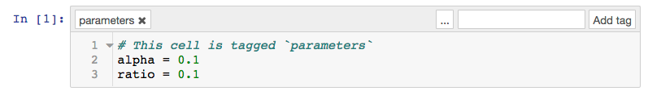
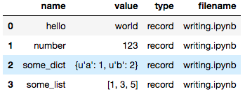

|Logo|
=========

Papermill is a tool for parameterizing, executing, and analyzing Jupyter Notebooks.

The goals for Papermill are:

* Parametrizing notebooks
* Executing and collecting metrics across the notebooks
* Summarizing collections of notebooks

Installation
------------

::

  pip install papermill

In-Notebook bindings
--------------------

* `Python <PythonBinding>`_ (here)
* `R`_

.. _R: https://github.com/nteract/papermillr

Usage
-----

**Parameterizing a Notebook.**

To parameterize your notebook designate a cell with the tag `parameters`. Papermill looks for the `parameters` cell
and replaces those values with the parameters passed in at execution time.

**Executing a Notebook**

The two ways to execute the notebook with parameters are through the Python API and through the command line interface.

Executing a Notebook via Python API

.. code-block:: python

   import papermill as pm

   pm.execute_notebook(
      notebook_path='path/to/input.ipynb',
      output_path='path/to/output.ipynb',
      parameters=dict(alpha=0.6, ratio=0.1)
   )

Executing a Notebook via CLI

.. code-block:: bash

   $ papermill local/input.ipynb s3://bkt/output.ipynb -p alpha 0.6 -p l1_ratio 0.1

.. _PythonBinding: 

**Recording Values to the Notebook**

Users can save values to the notebook document to be consumed by other notebooks.

Recording values to be saved with the notebook.

.. code-block:: python

   ### notebook.ipynb
   import papermill as pm

   pm.record("hello", "world")
   pm.record("number", 123)
   pm.record("some_list", [1,3,5])
   pm.record("some_dict", {"a":1, "b":2})

Users can recover those values as a Pandas dataframe via the the read_notebook function.

.. code-block:: python

   ### summary.ipynb
   import papermill as pm

   nb = pm.read_notebook('notebook.ipynb')
   nb.dataframe

**Displaying Plots and Images Saved by Other Notebooks**

Display a matplotlib histogram with the key name "matplotlib_hist".

.. code-block:: python

   ### notebook.ipynb
   # Import plt and turn off interactive plotting to avoid double plotting.
   import papermill as pm
   import matplotlib.pyplot as plt; plt.ioff()
   from ggplot import mpg

   f = plt.figure()
   plt.hist('cty', bins=12, data=mpg)
   pm.display('matplotlib_hist', f)

.. image:: docs/img/matplotlib_hist.png

Read in that above notebook and display the plot saved at "matplotlib_hist".

.. code-block:: python

   ### summary.ipynb
   import papermill as pm

   nb = pm.read_notebook('notebook.ipynb')
   nb.display_output('matplotlib_hist')

.. image:: docs/img/matplotlib_hist.png

**Analyzing a Collection of Notebooks**

Papermill can read in a directory of notebooks and provides the NotebookCollection interface for operating on them.

.. code-block:: python

   ### summary.ipynb
   import papermill as pm

   nbs = pm.read_notebooks('/path/to/results/')

   # Show named plot from 'notebook1.ipynb'
   # Accepts a key or list of keys to plot in order.
   nbs.display_output('train_1.ipynb', 'matplotlib_hist')

.. image:: docs/img/matplotlib_hist.png

.. code-block:: python

   # Dataframe for all notebooks in collection
   nbs.dataframe.head(10)

.. image:: docs/img/nbs_dataframe.png

.. |Logo| image:: https://user-images.githubusercontent.com/836375/27929844-6bb34e62-6249-11e7-9a2a-00849a64940c.png
   :width: 200px
   :target: https://github.com/nteract/papermill
   :alt: Papermill
