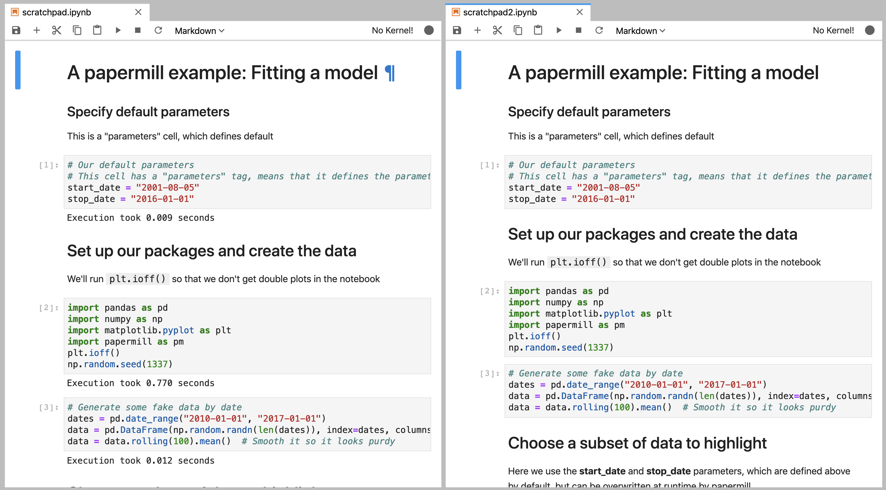

Extending papermill through entry points
========================================

What are entry points?
----------------------

The python packaging documentation describes `entry points`_ as:

    Entry points are a mechanism for an installed distribution to advertise
    components it provides to be discovered and used by other code. For example:

    Distributions can specify console_scripts entry points, each referring to a
    function. When pip (or another console_scripts aware installer) installs the
    distribution, it will create a command-line wrapper for each entry point.

    Applications can use entry points to load plugins; e.g. Pygments (a syntax
    highlighting tool) can use additional lexers and styles from separately
    installed packages. For more about this, see Creating and discovering
    plugins.

When running, papermill looks for `entry points`_ that implement input / output
(I/O) handlers, and execution handlers.

Developing new I/O handlers
---------------------------

Virtually the first thing that happens when papermill is used is that the input
notebook is read in. This is managed by I/O handlers, which allow papermill to
access not just the local filesystem, but also remote services such as Amazon
S3. The same goes for writing the executed notebook to a file system: I/O
handlers allow papermill to write files to S3 or otherwise.

Creating a new handler
~~~~~~~~~~~~~~~~~~~~~~

Writing your own I/O handler requires writing a class that has four
methods. All I/O handlers should implement the following class methods:

* ``CustomIO.read(file_path)``, returning the file content
* ``CustomIO.write(file_content, file_path)``, returning nothing
* ``CustomIO.pretty_path(path)``, returning a prettified path
* ``CustomIO.listdir(path)``, returning a list of paths.

.. note::

    If you don't want to support things such as ``read`` because your I/O
    handler is only intended for writing (such as a publish-only platform), then
    you should implement the method but raise an exception when it is used.

Ensuring your handler is found by papermill
~~~~~~~~~~~~~~~~~~~~~~~~~~~~~~~~~~~~~~~~~~~

Once you have developed a new handler, you need to declare papermill entry
points in your ``setup.py`` file.

This is done by including the ``entry_points`` key-word argument to ``setup``
in your setup.py file:

.. code-block:: python

    from setuptools import setup, find_packages
    setup(
        # all the normal setup.py arguments...
        entry_points={"papermill.io": ["sftp://=papermill_sftp:SFTPHandler"]},
    )

This indicates to papermill that when a file path begins with ``sftp://``, it
should use the class ``papermill_sftp.SFTPHandler`` to handle reading or writing
to that path. Anything before the equal sign is the path prefix, and everything
after it is the class to be used, including where it is imported from.

Traditionally, entry points for papermill I/O handlers look like URL prefixes.
For example, the Amazon Web Services S3 handler is registered under ``s3://``,
and so is used whenever a path begins with ``s3://``.

Example: sftp I/O handler
~~~~~~~~~~~~~~~~~~~~~~~~~~~~~~~

As an example, let's go through how we would create an I/O handler that reads
from an sftp server and writes back to it, so we could do the following::

    papermill sftp://my_ftp_server.co.uk/input.ipynb sftp://my_ftp_server.co.uk/output.ipynb

Our project structure will look like this::

    papermill_sftp
        |- setup.py
        |- src
            |- papermill_sftp
                |- __init__.py

We can define the I/O handler in ``src/papermill_sftp/__init__.py``. To do so,
we have to create a class that does the relevant actions.

For reading, we will download the file to a temporary path and read it in from
there. For writing, we will write to a temporary path and upload it from there.
Prettifying the path doesn't need to change the path, and we are not going to
implement a listdir option for now.

.. code-block:: python

    import os
    import pysftp

    sftp_username = os.getenv('SFTP_USERNAME')
    sftp_password = os.getenv('SFTP_PASSWORD')

    class SFTPHandler:

        @classmethod
        def read(cls, path):
            """
            Read a notebook from an SFTP server.
            """
            parsed_url = urllib.parse.urlparse(path)
            with tempfile.TemporaryDirectory() as tmpdir:
                tmp_file = pathlib.Path(tmpdir) / pathlib.Path(parsed_url.path).name
                with pysftp.Connection(
                    parsed_url.hostname,
                    username=sftp_username,
                    password=sftp_password,
                    port=(parsed_url.port or 22),
                    cnopts=cnopts,
                ) as sftp:
                    sftp.get(parsed_url.path, str(tmp_file))
                return tmp_file.read_text()

        @classmethod
        def write(cls, file_content, path):
            """
            Write a notebook to an SFTP server.
            """
            parsed_url = urllib.parse.urlparse(path)
            with tempfile.TemporaryDirectory() as tmpdir:
                tmp_file = pathlib.Path(tmpdir) / "output.ipynb"
                tmp_file.write_text(file_content)
                with pysftp.Connection(
                    parsed_url.hostname,
                    username=sftp_username,
                    password=sftp_password,
                    port=(parsed_url.port or 22),
                    cnopts=cnopts,
                ) as sftp:
                    sftp.put(str(tmp_file), parsed_url.path)

        @classmethod
        def pretty_path(cls, path):
            return path

        @classmethod
        def listdir(cls, path):
            raise NotImplementedError

The ``setup.py`` file contains the following code:

.. code-block:: python

    from setuptools import setup, find_packages

    setup(
        name="papermill_sftp",
        version="0.1",
        url="https://github.com/my_username/papermill_sftp.git",
        author="My Name",
        author_email="my.email@gmail.com",
        description="An SFTP I/O handler for papermill.",
        packages=find_packages("./src"),
        package_dir={"": "src"},
        install_requires=["pysftp"],
        entry_points={"papermill.io": ["sftp://=papermill_sftp:SFTPHandler"]},
    )

When executing, papermill will check if the input or output path begin with
``sftp://``, and if so, use the SFTPHandler from the papermill_sftp project.

Developing a new engine
-----------------------

A papermill engine is a python object that can run, or execute, a notebook. The
default implementation in papermill for example takes in a notebook object, and
runs it locally on your machine.

By writing a custom engine, you could allow execution to be handled remotely, or
you could apply post-processing to the executed notebook. In the next section,
you will see a demonstration.

Creating a new engine
~~~~~~~~~~~~~~~~~~~~~

Papermill engines need to inherit from the ``papermill.engines.Engine`` class.

In order to be used, the new class needs to implement the class method
``execute_managed_notebook``. The call signature should match that of the parent
class:

.. code-block:: python

    class CustomEngine(papermill.engines.Engine):

        @classmethod
        execute_managed_notebook(cls, nb_man, kernel_name, **kwargs):
            pass

``nb_man`` is a |nbformat.NotebookNode|_, and ``kernel_name`` is a string. Your
custom class then needs to implement the execution of the notebook. For example,
you could insert code that executes the notebook remotely on a server, or
executes the notebook many times to simulate different conditions.

As an example, the following project implements a custom engine that adds the
time it took to execute each cell as additional output after every code cell.

The project structure is::

    papermill_timing
        |- setup.py
        |- src
            |- papermill_timing
                |- __init__.py

The file ``src/papermill_timing/__init__.py`` will implement the engine. Since
papermill already stores information about execution timing in the metadata,
we can leverage the default engine. We will also need to use the ``nbformat``
library to create a `notebook node object`_.

.. code-block:: python

    from datetime import datetime
    from papermill.engines import NBClientEngine
    from nbformat.v4 import new_output

    class CustomEngine(NBClientEngine):

        @classmethod
        def execute_managed_notebook(cls, nb_man, kernel_name, **kwargs):

            # call the papermill execution engine:
            super().execute_managed_notebook(nb_man, kernel_name, **kwargs)

            for cell in nb_man.nb.cells:

                if cell.cell_type == "code" and cell.execution_count is not None:
                    start = datetime.fromisoformat(cell.metadata.papermill.start_time)
                    end = datetime.fromisoformat(cell.metadata.papermill.end_time)
                    output_message = f"Execution took {(end - start).total_seconds():.3f} seconds"
                    output_node = new_output("display_data", data={"text/plain": [output_message]})
                    cell.outputs = [output_node] + cell.outputs

Once this is in place, we need to add our engine as an entry point to our
``setup.py`` script - for this, see the following section.

Ensuring your engine is found by papermill
~~~~~~~~~~~~~~~~~~~~~~~~~~~~~~~~~~~~~~~~~~

Custom engines can be specified as `entry points`_, under the
``papermill.engine`` prefix. The entry point needs to reference the class that
we have just implemented. For example, if you write an engine called
TimingEngine in a package called papermill_timing, then in the ``setup.py``
file, you should specify:

.. code-block:: python

    from setuptools import setup, find_packages

    setup(
        name="papermill_timing",
        version="0.1",
        url="https://github.com/my_username/papermill_timing.git",
        author="My Name",
        author_email="my.email@gmail.com",
        description="A papermill engine that logs additional timing information about code.",
        packages=find_packages("./src"),
        package_dir={"": "src"},
        install_requires=["papermill", "nbformat"],
        entry_points={"papermill.engine": ["timer_engine=papermill_timing:TimingEngine"]},
    )

This allows users to specify the engine from ``papermill_timing`` by passing the
command line argument ``--engine timer_engine``.

In the image below, the notebook on the left was executed with the new custom
engine, while the one on the left was executed with the standard papermill
engine. As you can see, this adds our "injected" output to each code cell

.. _`entry points`: https://packaging.python.org/specifications/entry-points/
.. |nbformat.NotebookNode| replace:: ``nbformat.NotebookNode`` object
.. _nbformat.NotebookNode: https://nbformat.readthedocs.io/en/latest/api.html#notebooknode-objects
.. _`notebook node object`: https://nbformat.readthedocs.io/en/latest/api.html#module-nbformat.v4