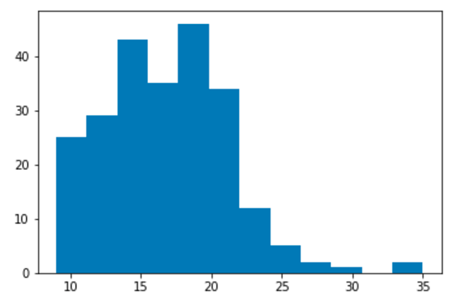

Notebook Collections
====================

**DEPRECATED** This functionality will be removed entirely in papermill 1.0.
See scrapbook's `Scrapbook <https://nteract-scrapbook.readthedocs.io/en/latest/usage-read-notebooks.html>`_.

.. seealso::

    :doc:`API reference <./reference/papermill-api>`

Papermill can read in a directory of notebooks. It provides the
``NotebookCollection`` interface for operating on the directory
of notebooks.

Read a collection of notebooks
------------------------------

In this example, a collection of notebooks is created from the
notebooks found in a directory at a given path.

.. code-block:: python

   """summary.ipynb"""
   import papermill as pm

   nbs = pm.read_notebooks('/path/to/results/')

Display output for a collection
-------------------------------

.. code-block:: python

   """summary.ipynb"""
   import papermill as pm

   nbs = pm.read_notebooks('/path/to/results/')

   # Show named plot from 'notebook1.ipynb'
   # Accepts a key or list of keys to plot in order.
   nbs.display_output('train_1.ipynb', 'matplotlib_hist')

Use a dataframe of the collection
---------------------------------

A dataframe can be created from the notebooks in a collection.

In this example, the ``dataframe`` contains information about
the notebook collection ``nbs``. Common dataframe operations, such
as used in pandas, can be done on the collection dataframe. Here
we are displaying the top 10 rows of the dataframe.

.. code-block:: python

   # Dataframe for all notebooks in collection
   nbs.dataframe.head(10)

.. image:: img/nbs_dataframe.png
