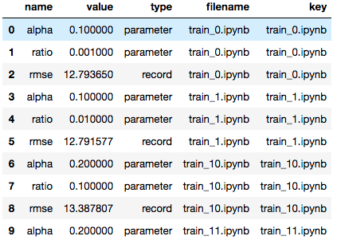

Task: Analyzing a Collection of Notebooks
=========================================

.. seealso::

    reference/papermill-api.rst

Papermill can read in a directory of notebooks. It provides the
``NotebookCollection`` interface for operating on the directory
of notebooks.

Read a collection of notebooks
------------------------------

.. code-block:: python
    :highlight: 4

   """summary.ipynb"""
   import papermill as pm

   nbs = pm.read_notebooks('/path/to/results/')

Display output for a collection
-------------------------------

.. code-block:: python
    :highlight: 6

   """summary.ipynb"""
   import papermill as pm

   nbs = pm.read_notebooks('/path/to/results/')

   # Show named plot from 'notebook1.ipynb'
   # Accepts a key or list of keys to plot in order.
   nbs.display_output('train_1.ipynb', 'matplotlib_hist')

.. image:: img/matplotlib_hist.png

Use a dataframe of the collection
---------------------------------

.. code-block:: python

   # Dataframe for all notebooks in collection
   nbs.dataframe.head(10)

