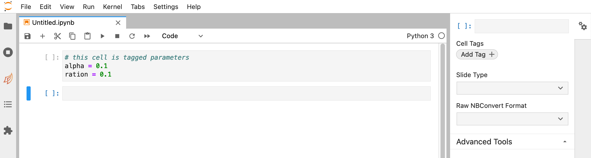
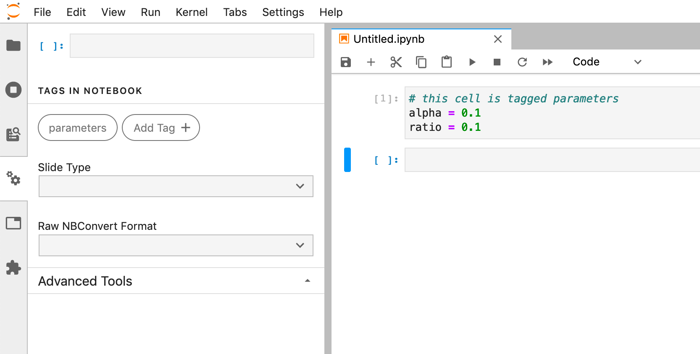

Parameterize
============

.. seealso::

    :doc:`Workflow reference <./reference/papermill-workflow>`

Generally, the first workflow step when using papermill is to parameterize the
notebook.

To do this, tag notebook cells with ``parameters``. These ``parameters`` are
later used when the notebook is executed or run.

Designate parameters for a cell
-------------------------------

To parameterize a notebook, designate a cell with the tag ``parameters``.

.. image:: img/parameters.png

Notebook
~~~~~~~~

If using the `Jupyter Notebook`_ interface

1. Activate the tagging toolbar by navigating to ``View``, ``Cell Toolbar``, and then ``Tags``
2. Enter ``parameters`` into a textbox at the top right of a cell
3. Click ``Add tag``

JupyterLab 3.0+
~~~~~~~~~~~~~~~

If using `JupyterLab`_ v3 or above:

1. Select the cell to parameterize
2. Click the property inspector in the right sidebar (double gear icon)
3. Type "parameters" in the "Add Tag" box and hit "Enter".

JupyterLab 2.0 - 2.2.x
~~~~~~~~~~~~~~~~~~~~~~

If using the `JupyterLab`_ interface

1. Select the cell to parameterize
2. Click the property inspector on the left side (double gear icon)
3. Type "parameters" in the "Add Tag" box and hit "Enter".

JupyterLab < 2.0
~~~~~~~~~~~~~~~~
If using JupyterLab < 2.0, consider using the
`jupyterlab-celltags`_ extension.

1. Select the cell to parameterize
2. Click the cell inspector (wrench icon)
3. Type "parameters" in the "Add Tag" box and hit "Enter".

If the extension is not installed, you can manually add the tag by
editing the Cell Metadata field in the cell inspector by adding "tags":["parameters"].

Learn more about the jupyter notebook format and metadata fields `here`_.

How parameters work
-------------------

The ``parameters`` cell is assumed to specify default values which may be
overridden by values specified at execution time.

- papermill inserts a new cell tagged ``injected-parameters`` immediately after
  the ``parameters`` cell
- ``injected-parameters`` contains only the overridden parameters
- subsequent cells are treated as normal cells, even if also tagged ``parameters``
- if no cell is tagged ``parameters``, the ``injected-parameters`` cell
  is inserted at the top of the notebook

One caveat is that a ``parameters`` cell may not behave intuitively with
inter-dependent parameters. Consider a notebook ``note.ipynb`` with two cells:

.. code-block:: python

  #parameters
  a = 1
  twice = a * 2

.. code-block:: python

  print("a =", a, "and twice =", twice)

when executed with ``papermill note.ipynb -p a 9``, the output will be
``a = 9 and twice = 2`` (not ``twice = 18``).

.. _`JupyterLab`: https://github.com/jupyterlab/jupyterlab
.. _`Jupyter Notebook`: https://github.com/jupyter/notebook
.. _`here`: https://ipython.org/ipython-doc/dev/notebook/nbformat.html#cell-metadata
.. _`jupyterlab-celltags`: https://github.com/jupyterlab/jupyterlab-celltags
